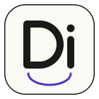
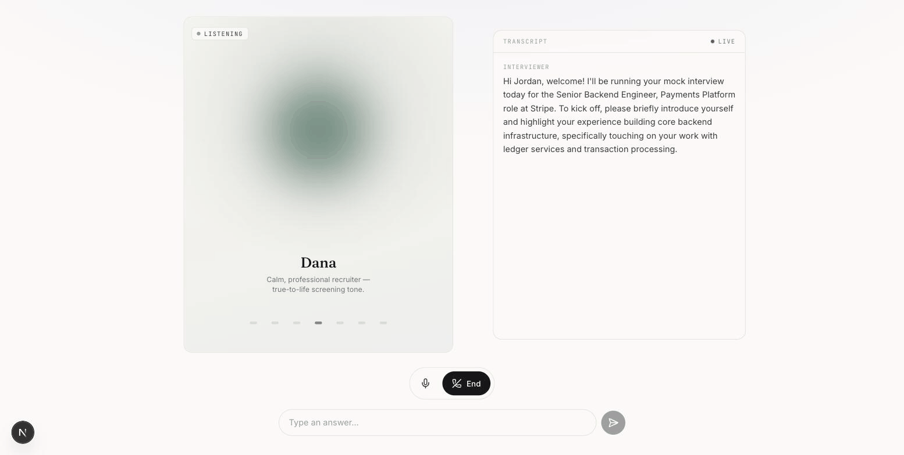
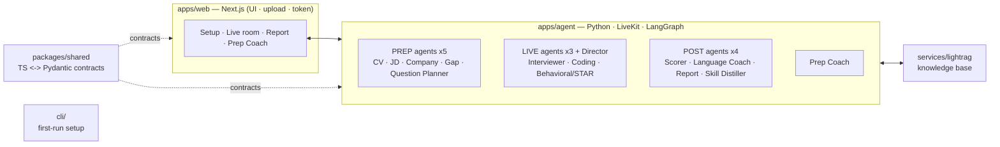

<div align="center">



# DeepInterview: AI phỏng vấn thử bằng giọng nói, đa ngôn ngữ

### Luyện phỏng vấn bằng cách nói thành tiếng. Rồi vượt qua buổi thật. · Multi-agent · Mã nguồn mở

[](LICENSE)
[](https://github.com/ngoanpv/DeepInterview/actions)
[](https://github.com/ngoanpv/DeepInterview/releases)
[](https://github.com/ngoanpv/DeepInterview/stargazers)
[](apps/agent)
[](pnpm-workspace.yaml)
[](https://discord.gg/fT7Ecbyq)
[](CONTRIBUTING.md)

**Giao diện tiếng Anh + Tiếng Việt · phỏng vấn bằng giọng nói ở 7 ngôn ngữ, có tiếng Việt (thêm nữa khi có pack mới) · self-host không cần đăng nhập**

[English](README.md) · **Tiếng Việt**

[Bắt đầu nhanh](#bắt-đầu-nhanh) · [Vì sao](#vì-sao-là-deepinterview) · [Tính năng](#tính-năng) · [Kiến trúc](#kiến-trúc) · [Cộng đồng](#cộng-đồng) · [Đóng góp](#đóng-góp)

**Rất mong bạn đóng góp** — [pack ngân hàng câu hỏi](https://github.com/ngoanpv/DeepInterview/issues/38) · [language pack & provider adapter](docs/GOOD_FIRST_ISSUES.md) · pack bạn viết sẽ được hỏi trong buổi phỏng vấn thật, và phát triển thì không cần API key nào cả.

</div>

---

<!-- HERO: live voice interview → scored report, recorded from the real app. -->


> **Tải lên CV và mô tả công việc. Nói chuyện với một AI phỏng vấn. Nhận điểm — và được hướng dẫn đúng chỗ bạn còn thiếu.** Ưu tiên giọng nói, ưu tiên tiếng Anh, và đa ngôn ngữ ngay từ thiết kế.

DeepInterview khép kín vòng lặp **chuẩn bị ⇄ phỏng vấn ⇄ phản hồi**: phần suy luận nặng chạy *trước* buổi gọi (đọc CV + JD, nghiên cứu công ty, dựng kế hoạch câu hỏi thích ứng), một vòng lặp giọng nói real-time gọn nhẹ chạy buổi phỏng vấn, rồi các model mạnh chấm điểm và đưa bạn vào một study coach cho đúng những phần còn yếu.

> **Trạng thái thật:** đây là một **bản mở giai đoạn sớm**. Phần contract, pipeline prep/live/post, các màn hình web và CLI đều đã có và **chạy offline với mock adapter** (không cần API key, test xanh). Giọng nói real-time, tìm kiếm web và avatar video thì cần key của provider. `docker compose up` dựng nguyên base stack (web + agent API + knowledge sidecar, healthy mà không cần key nào); worker giọng nói chạy bằng `docker compose --profile live up` sau khi có key LiveKit. Xuyên suốt README này, cái gì xong tới đâu chúng tôi ghi đúng tới đó.

## Bắt đầu nhanh

> **Không cần đăng nhập.** Bản self-host mã nguồn mở chạy **ẩn danh** — thiết lập, phỏng vấn trực tiếp và báo cáo đều chạy được mà **không cần tài khoản, không cần đăng nhập**. (Báo cáo đọc thẳng từ agent API.) Supabase auth + billing chỉ thuộc về bản hosted; bạn không cần chúng để tự chạy vòng lặp này.
>
> **Demo không cần tải file:** màn hình `/setup` có nút **Quick demo** điền sẵn CV + JD mẫu, để bạn thử trọn vòng lặp mà không phải upload gì.

**Yêu cầu:** Node **20+** (khuyến nghị 22 — xem [`.nvmrc`](.nvmrc)) · pnpm 11 · Python 3.11+ kèm [uv](https://docs.astral.sh/uv/) (cho agent) · Docker (cho full stack).

### 1. Đường offline (đã kiểm chứng — không cần API key)

Đây chính là thứ CI đang test mỗi ngày. Nó build contract, chạy test suite, và chạy pipeline prep/live/post trên **mock adapter** — không cần key của provider nào.

```bash
git clone https://github.com/ngoanpv/DeepInterview.git
cd DeepInterview

pnpm install          # cài workspace JS/TS
pnpm build            # build packages/shared (contracts) + cli + web
pnpm test             # test parity TS + Pydantic và pipeline (offline, mock adapter)

pnpm deepinterview init   # tạo .env từ .env.example (điền key sau cũng được)
```

> `pnpm build` phải chạy trước `pnpm deepinterview init` — CLI được build vào `cli/dist/`.
> Với agent Python: `uv --directory apps/agent sync` rồi `uv --directory apps/agent run pytest`.

### 2. Đường full-stack (`docker compose up` — đã kiểm chứng)

```bash
pnpm deepinterview init    # hoặc: cp .env.example .env  (key là tuỳ chọn — xem ghi chú)
docker compose up --build  # web (:3000) + agent API (:8000) + lightrag (:9621)
```

> **Trạng thái (kiểm chứng tháng 7/2026, Docker 29 / Compose v5):** tất cả image build được và ba service nền lên **healthy mà không cần key nào** — agent chạy trọn vòng prep → plan → score trên mock adapter, và http://localhost:3000 hoạt động offline.
>
> - **Docker chỉ đọc `.env` ở thư mục gốc** (compose `env_file`). Còn dev cục bộ (`pnpm dev`) đọc `apps/agent/.env` và `apps/web/.env.local` — key đặt ở đó container **không** thấy, nên với Docker hãy để key trong `.env` gốc.
> - **Worker giọng nói** là opt-in: `docker compose --profile live up`. Nó **bắt buộc** phải có `LIVEKIT_URL` / `LIVEKIT_API_KEY` / `LIVEKIT_API_SECRET` (cộng thêm key STT/TTS/LLM) trong `.env` gốc; thiếu thì worker thoát và restart liên tục trong khi base stack vẫn chạy bình thường.

### 3. Deploy một cú nhấp

[](https://vercel.com/new/clone?repository-url=https://github.com/ngoanpv/DeepInterview)

Nút này deploy **`apps/web`** lên Vercel. **Agent** Python thì không chạy serverless được — hãy chạy nó bằng **Docker** (image `agent-api` ở trên) hoặc trên **[LiveKit Cloud Agents](https://docs.livekit.io/agents/)** cho worker giọng nói, rồi trỏ web app tới nó qua `AGENT_API_URL`. Xem [`docs/DEPLOY.md`](docs/DEPLOY.md) (WP-12, đang làm).

<details><summary>Cấu hình provider & thêm một language pack</summary>

- **Key** chỉ nằm trong `.env` (không bao giờ commit). Xem [`.env.example`](.env.example) để có danh sách đầy đủ (LiveKit, Supabase, R2, STT/TTS/LLM, Tavily/Exa, observability).
- **Chọn provider** theo từng thành phần: đặt `STT_PROVIDER`, `TTS_PROVIDER`, `LLM_PROVIDER` và key tương ứng. Không đặt key nào thì agent lùi về **mock adapter** để mọi thứ vẫn chạy offline.
- **Ngôn ngữ** là các pack cắm thêm được. Chuỗi giao diện nằm ở `apps/web/lib/i18n/messages/` (đã có EN + VI); `text` của mỗi câu hỏi trong kế hoạch là một map `LocalizedText` (`text.en` / `text.vi` / …) đi kèm `language_mode`.

Xem [CONTRIBUTING.md](CONTRIBUTING.md) để biết cách setup dev đầy đủ và mẫu provider-adapter.

</details>

## Vì sao là DeepInterview

Luyện trong đầu (hoặc luyện bằng chat chữ) không giống cách một buổi phỏng vấn diễn ra. DeepInterview **ưu tiên giọng nói** — bạn trả lời thành tiếng, theo thời gian thực, đúng như thật — và được xây để bạn **sở hữu, chứ không phải đi thuê**:

- **Một cuộc hội thoại thật, không phải cái form** — vòng lặp **STT → LLM → TTS** nối tầng trên LiveKit, có barge-in (ngắt lời), nhận biết kết thúc lượt nói theo ngữ nghĩa, và câu hỏi đào sâu thích ứng, để người phỏng vấn phản ứng với *điều bạn thực sự vừa nói*.
- **Chuẩn bị như một người phỏng vấn thật** — trước buổi gọi nó đọc CV + JD, nghiên cứu công ty, và tính sẵn một kế hoạch câu hỏi cá nhân hoá kèm rubric; vòng lặp live nhờ vậy mà nhanh, vì phần suy nghĩ đã xong từ trước.
- **Phản hồi dùng được ngay** — điểm rubric theo từng năng lực, câu trả lời mẫu, và một study coach nhắm đúng những lỗ hổng mà buổi phỏng vấn vừa phơi ra (vòng lặp khép kín chuẩn bị ⇄ phỏng vấn ⇄ phản hồi).
- **Đa ngôn ngữ từ thiết kế** — giao diện EN+VI, phỏng vấn giọng nói ở 7 ngôn ngữ gồm tiếng Việt; STT/TTS tự định tuyến theo ngôn ngữ, và mỗi ngôn ngữ là một pack cắm thêm được.
- **Của bạn từ đầu tới cuối** — Apache 2.0, self-host trọn vẹn, **tự mang key** cho mọi provider — hoặc **chạy toàn bộ model ngay trên máy bạn** (Ollama + Whisper + Kokoro, [docs/LOCAL_MODELS.md](docs/LOCAL_MODELS.md)) — và **không cần đăng nhập**: không tài khoản, không login, không dữ liệu nào rời khỏi máy bạn trừ khi chính bạn chọn một provider.

## Tính năng

- **Chuẩn bị cá nhân hoá** — một pipeline LangGraph đọc CV + JD, nghiên cứu công ty mục tiêu, đối chiếu khoảng cách, rồi **Question Planner** tính sẵn kế hoạch, đường cong độ khó, rubric và các câu đào sâu gieo trước — để vòng lặp live luôn nhanh. **CV dạng tài liệu (PDF/DOCX) được parse sang text ở phía server bằng [Microsoft markitdown](https://github.com/microsoft/markitdown), có fallback đa phương thức qua Gemini cho PDF scan/ảnh**.
- **Thư viện playbook cộng đồng** — các pack ngân hàng câu hỏi trong [`skills/`](skills/) (Markdown + YAML có version) được truy xuất theo vai trò/cấp bậc rồi đưa vào Question Planner: pack cộng đồng viết ra sẽ được hỏi trong buổi phỏng vấn thật. Kiểm tra pack của bạn bằng `pnpm deepinterview skills lint`.
- **Phản hồi có chấm điểm** — một evaluator theo rubric cùng một language coach viết ra `ScoreCard` cho từng năng lực, kèm điểm mạnh, lỗ hổng, câu trả lời mẫu và bước tiếp theo, ánh xạ thẳng về đúng những câu bạn đã bị hỏi.
- **Prep Coach** *(đang làm)* — biến các lỗ hổng của bạn thành một vòng học có LLM (kế hoạch → bài luyện → hội thoại Socratic). Câu trả lời có dẫn nguồn là **tuỳ chọn**: đặt `LIGHTRAG_URL` (hoặc gắn một RAG managed sau cùng adapter đó) để neo câu trả lời vào tài liệu bạn tải lên; mặc định thì coach trả lời trung thực mà không bịa trích dẫn.
- **Avatar tiết kiệm chi phí** *(đang làm)* — hệ thống crossfade và persona dự phòng đã xong; các vòng lặp idle/speaking dựng sẵn từ **bất kỳ trình tạo video nào** sẽ cắm vào khi có pack ([docs/AVATARS.md](docs/AVATARS.md) — trong lúc chờ, nó hiển thị một nền gradient tĩnh). Chỉ dùng persona gốc (không nhân vật có bản quyền), nên chi phí lúc chạy **chỉ là CDN — không tính phí theo phút cho avatar**.

## Ma trận provider

**Mọi tầng đều thay được — cứ mang vendor của bạn tới.** Vòng lặp giọng nói là **STT → LLM → TTS nối tầng** trên LiveKit; bạn chọn từng vendor bằng đúng một biến môi trường (`STT_PROVIDER` / `TTS_PROVIDER` / `LLM_PROVIDER`) cộng key của nó. Không sửa code, không khoá vendor — provider nằm sau một adapter interface gọn gàng, và thêm một cái mới chỉ là một PR nhỏ (xem [CONTRIBUTING.md](CONTRIBUTING.md)). Không đặt key nào thì mọi tầng lùi về **mock adapter** offline, nên trọn vòng lặp vẫn chạy trong CI và ngay lần clone đầu tiên.

| Tầng | Chọn bằng | Vendor cloud (chọn một) | Chạy hẳn trên máy | Không đặt key |
|---|---|---|---|---|
| **STT** | `STT_PROVIDER` | **Deepgram nova-3** (mặc định) · Soniox | **`whisper`** · **`qwen3-asr`** — bất kỳ server tương thích OpenAI | mock adapter |
| **TTS** | `TTS_PROVIDER` | **Cartesia sonic** (mặc định) · ElevenLabs Flash v2.5 · Gemini TTS | **`kokoro`** — kokoro-fastapi | mock adapter |
| **LLM** | `LLM_PROVIDER` | **Gemini live tier** (mặc định) · OpenAI | **`ollama`** — ví dụ Qwen3 | mock adapter |

### Chạy 100% trên máy bạn

```bash
pnpm deepinterview init      # chọn "100% local models"
```

Lệnh này đặt `LLM_PROVIDER=ollama`, `STT_PROVIDER=whisper`, `TTS_PROVIDER=kokoro` — mọi
model chạy ngay trên máy bạn, không cần key LLM/STT/TTS, và không có gì trong CV rời
khỏi máy. Đã kiểm chứng đầu-cuối trên Apple Silicon với `qwen3:8b`: một kế hoạch câu
hỏi bám sát CV trong khoảng 2 phút, rồi **một buổi phỏng vấn giọng nói với micro thật**
chạy tới tận báo cáo chấm điểm.

Hai lưu ý thẳng thắn: **LiveKit vẫn là lớp truyền tải real-time** (dùng LiveKit Cloud,
hoặc `livekit-server --dev` cho một stack offline hoàn toàn), và STT chạy local là dạng
theo lô, nên phụ đề hiện theo từng câu nói chứ không theo từng từ. Độ trễ mỗi lượt nói
trên model local thì chưa được đo chuẩn, và Kokoro chưa có giọng tiếng Việt.
Hướng dẫn cài đặt đầy đủ, ghi chú phần cứng và xử lý sự cố: **[docs/LOCAL_MODELS.md](docs/LOCAL_MODELS.md)**.
Muốn chạy qua một gateway tương thích OpenAI (OpenRouter và tương tự), hoặc đang kẹt trên
**máy chỉ có CPU** không kham nổi stack giọng nói? Xem
[docs/OPENROUTER_AND_CPU_ONLY.md](docs/OPENROUTER_AND_CPU_ONLY.md).

> **Định tuyến ngôn ngữ là tự động — không phải thứ bạn phải cấu hình.** Nếu TTS bạn chọn không hỗ trợ ngôn ngữ của phiên (ví dụ tiếng Việt trên Cartesia), agent sẽ chuyển phiên đó sang ElevenLabs hoặc Gemini TTS khi có key. Cartesia hỗ trợ en, es, zh, fr, de, ja, pt, hi, it, ko, nl, pl, ru, sv, tr; Deepgram nova-3 hỗ trợ tiếng Anh và nhiều ngôn ngữ khác (tiếng Việt đang trong quá trình kiểm chứng).

## Tin mới

> - **[2026.08]** **Chạy trọn hệ thống ngay trên máy bạn.** Các tầng LLM, speech-to-text và text-to-speech giờ trỏ được vào server tương thích OpenAI chạy cục bộ — **Ollama**, một server **Whisper** local và **Kokoro** — nên một buổi phỏng vấn không cần bất kỳ key model nào. Đã kiểm chứng đầu-cuối trên Apple Silicon; ghép với `livekit-server --dev` là có stack offline hoàn toàn. Hiện mới có giọng tiếng Anh, và độ trễ mỗi lượt chưa đo chuẩn. Xem [docs/LOCAL_MODELS.md](docs/LOCAL_MODELS.md).
> - **[2026.07]** **Đã lên Gemini 3.6 Flash + LiveKit Agents 1.6.** Phần chuẩn bị và chấm điểm chạy trên **Gemini 3.6 Flash**; stack giọng nói chuyển sang livekit-agents 1.6 (function calling sẵn sàng cho Gemini 3 ngay trên đường lượt nói), và phụ đề trực tiếp giờ đọc thành một đoạn liền cho mỗi người nói thay vì các dòng vụn.
> - **[2026.07]** **Bản mã nguồn mở bỏ hẳn giới hạn — đã gỡ billing.** Cứ self-host với key của bạn: không cổng gói cước, không giới hạn số buổi phỏng vấn, không bảng billing. Thanh toán chỉ tồn tại ở bản hosted; schema của bản OSS nhờ vậy gọn hơn.
> - **[2026.07]** **Bản gia cố.** Xác thực bằng shared secret (tuỳ chọn) cho agent API và knowledge sidecar, siết chặt row policy của Supabase, và checkpoint transcript định kỳ để một tiến trình bị kill chỉ mất vài giây phỏng vấn thay vì mất sạch.
> - **[2026.07]** **Study coach giờ neo câu trả lời vào chính phiên của bạn.** Phần chuẩn bị nạp CV, JD và kết quả nghiên cứu công ty vào knowledge sidecar theo khoá phiên — câu trả lời của coach trích từ tài liệu của chính bạn, không phải lời khuyên chung chung.
> - **[2026.06]** **Phỏng vấn giọng nói chạy trên provider thật.** Trọn vòng lặp — chuẩn bị cá nhân hoá (Gemini phân tích CV/JD thật + nghiên cứu công ty) → phỏng vấn giọng nói real-time trên LiveKit (Deepgram STT · Gemini · Cartesia/ElevenLabs TTS) → báo cáo chấm điểm — đã chạy được đầu-cuối, có nhận biết kết thúc lượt theo ngữ nghĩa và barge-in chống ồn theo ngưỡng số từ.
> - **[tiếp theo]** Một bản demo trực tuyến, và thêm nhiều language pack.

_(Trung thực là chính sách — không tuyên bố tính năng nào đã xong khi nó chưa xong. Mục cũ dồn vào [CHANGELOG.md](CHANGELOG.md).)_

## Phát hành

Bản hiện tại: **[v0.3.0](https://github.com/ngoanpv/DeepInterview/releases/tag/v0.3.0)** (02/08/2026) — đường chạy model hoàn toàn cục bộ (Ollama + Whisper + Kokoro) để một buổi phỏng vấn không cần key model nào, đặt trên nền vòng lặp của v0.2.0: chuẩn bị → phỏng vấn giọng nói → chấm điểm → coach đã kiểm chứng trên provider thật, bản OSS không giới hạn và không billing, bề mặt API đã gia cố, và thư viện playbook cộng đồng đã nối vào question planner. Xem [Releases](https://github.com/ngoanpv/DeepInterview/releases) để đọc ghi chú; metadata trích dẫn nằm trong [`CITATION.cff`](CITATION.cff).

## Kiến trúc

Xương sống của hệ thống là phân tách **prep / live / post** (model mạnh chạy bất đồng bộ trước và sau buổi gọi; một model nhanh gọn duy nhất trên đường lượt nói). Cả ba pha cùng xâu chuỗi một "bảng đen" `InterviewContext` dùng chung — ghi ở prep, đọc + ghi thêm ở live, đọc ở post.

**Tổng quan — các agent & thiết kế repo:**



**Ranh giới module:** `apps/web` lo UI/auth/upload/token và không biết gì về LLM/STT/TTS · `apps/agent` lo vòng lặp giọng nói + pipeline prep/post + tiện ích render avatar · `services/lightrag` lo knowledge base · `cli/` lo thiết lập lần đầu · **`packages/shared` là contract xuyên ngôn ngữ** (TS là nguồn chuẩn, soi chiếu sang Pydantic).

Sơ đồ luồng request đầy đủ và thiết kế multi-agent nằm trong [`docs/ARCHITECTURE.md`](docs/ARCHITECTURE.md).

## Dùng DeepInterview

| Phiên bản | Bạn nhận được gì | Auth & billing | Trạng thái |
|---|---|---|---|
| **Self-host (Apache 2.0)** | Toàn bộ nền tảng, key của bạn, dữ liệu của bạn. Chạy **ẩn danh** — không cần đăng nhập. | Không cần | ✅ Có ngay bây giờ (repo này) |
| **Cloud (hosted)** | Hosting có sẵn kèm tài khoản và các gói, để bạn khỏi lo vận hành. | Supabase auth + billing | 🟡 Dự kiến (chưa ra mắt) |

> **Lớp auth + billing chỉ thuộc bản hosted** — bản mã nguồn mở self-host chạy trọn vòng chuẩn bị → phỏng vấn → báo cáo → coach mà không cần tài khoản nào.

## Cộng đồng

- **[Discord](https://discord.gg/fT7Ecbyq)** — vào chat xây dựng công khai cùng nhau.
- **[GitHub Discussions](https://github.com/ngoanpv/DeepInterview/discussions)** — câu hỏi, ý tưởng, yêu cầu language pack và playbook.
- **[Issues](https://github.com/ngoanpv/DeepInterview/issues)** — lỗi & tính năng (có sẵn template).
- **[Thư viện playbook](skills/README.md)** — các pack ngân hàng câu hỏi xem được trực tiếp, ảnh hưởng thẳng tới câu hỏi mà AI đặt ra; rất mong bạn đóng góp ([#38](https://github.com/ngoanpv/DeepInterview/issues/38)).

Được xây công khai, với [Claude Code](https://claude.com/claude-code) là một đồng tác giả được dùng rất nhiều — AI phỏng vấn đã từ chối phỏng vấn nó. Chúng tôi có trả lời issue — bỏ rơi người đóng góp là nguyên nhân số một khiến dự án mã nguồn mở chết, và chúng tôi không định làm vậy.

**Đứng trên vai người khác.** Đường chạy cục bộ được dựng trên
[LiveKit Agents](https://github.com/livekit/agents),
[Ollama](https://github.com/ollama/ollama),
[Kokoro-82M](https://huggingface.co/hexgrad/Kokoro-82M) và
[faster-whisper](https://github.com/SYSTRAN/faster-whisper). Nếu bạn muốn một
*voice pipeline* thuần cục bộ thay vì cả một nền tảng phỏng vấn, hãy xem
[`speech-to-speech` của **@huggingface**](https://github.com/huggingface/speech-to-speech)
(Apache-2.0) — cùng triết lý nối tầng VAD → STT → LLM → TTS như chúng tôi, có MLX
trên Apple Silicon và API tương thích OpenAI Realtime. Đó là dự án gần với chế độ
cục bộ của dự án này nhất, và là chỗ tốt nhất để bắt đầu nếu bạn tự lắp lấy.

## Đóng góp

Chúng tôi rất mong bạn giúp một tay — đặc biệt là **pack ngân hàng câu hỏi** ([#38](https://github.com/ngoanpv/DeepInterview/issues/38)), **language pack**, **provider adapter**, và **khả năng tiếp cận (accessibility)**. Bắt đầu từ:

- [CONTRIBUTING.md](CONTRIBUTING.md) — setup dev, bản đồ monorepo, mô hình work-package, mẫu provider-adapter (mock-first), và cách chạy **offline không cần key**.
- [Good first issues](docs/GOOD_FIRST_ISSUES.md) — các việc cụ thể, phạm vi rõ ràng, rút ra từ khoảng trống thật.
- [Code of Conduct](CODE_OF_CONDUCT.md) · [Chính sách bảo mật](SECURITY.md).

[](https://github.com/ngoanpv/DeepInterview/graphs/contributors)

## Trích dẫn

Nếu DeepInterview giúp ích cho công việc của bạn, hãy trích dẫn nó. Metadata đầy đủ nằm trong [`CITATION.cff`](CITATION.cff).

```bibtex
@software{deepinterview2026,
  title  = {DeepInterview: Voice-First, Multilingual AI Mock Interviewer},
  author = {The DeepInterview contributors},
  year   = {2026},
  license = {Apache-2.0},
  url    = {https://github.com/ngoanpv/DeepInterview}
}
```

---

<div align="center">

**Giấy phép:** [Apache-2.0](LICENSE) · Xây dựng công khai

[về đầu trang](#deepinterview-ai-phỏng-vấn-thử-bằng-giọng-nói-đa-ngôn-ngữ)

</div>
